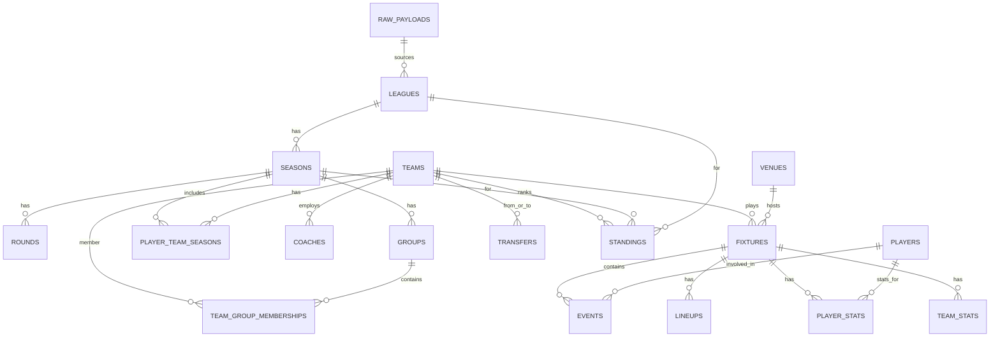

# Schema documentation — Football Analytics (API-Football v3)

This document maps the PostgreSQL schema in `db/db_schema.sql` to API-Football v3 endpoints and explains table/column purpose. It includes a Mermaid ER diagram for overview.

## High-level contract

- Inputs: JSON payloads from API-Football v3 endpoints (competitions, teams, players, fixtures, statistics, transfers, standings, injuries/news if available).
- Outputs: Normalized relational tables for analytics queries.
- Error modes: Partial data (nullable fields), duplicate upserts (use primary keys), inconsistent season formats (string year). Use upsert logic at ingestion layer.

## Mermaid ER diagram

> Note: The mermaid diagram is an overview — use the SQL schema for exact column-level relationships.

## Table-by-table mapping and source endpoints

- leagues
  - Purpose: store competition metadata
  - Key columns: id (API league id), name, country, logo, type
  - Source endpoint: /leagues (competitions)

- seasons
  - Purpose: league season details (year, start/end, coverage)
  - Key columns: id (uuid), league_id -> leagues.id, year, start_date, end_date
  - Source endpoint: /leagues/{id}?season= or season objects in /fixtures and /standings responses

- rounds
  - Purpose: named rounds (matchday names)
  - Key columns: id, season_id, name
  - Source endpoint: rounds are available in fixtures responses and season metadata

- groups
  - Purpose: group stage containers (e.g., Group A)
  - Key columns: id, season_id, name
  - Source endpoint: /standings (grouped tables) and fixtures

- venues
  - Purpose: stadium metadata
  - Key columns: id (API stadium id), name, city, capacity, coordinates
  - Source endpoint: /teams (venue) and fixtures (venue)

- teams
  - Purpose: team metadata
  - Key columns: id (API team id), name, logo, venue_id
  - Source endpoint: /teams, /fixtures, /standings

- coaches
  - Purpose: store coach/manager data
  - Key columns: id (API coach id), team_id, name, nationality
  - Source endpoint: /teams, /coachs (if available) or team endpoints that return coach

- players
  - Purpose: player profiles
  - Key columns: id (API player id), name, nationality, birth_date
  - Source endpoint: /players, /teams/{id}/players

- player_team_seasons
  - Purpose: map players to teams within seasons (contracts, numbers)
  - Key columns: player_id, team_id, season_id, number, position
  - Source endpoint: /players (statistics + team history), /transfers

- fixtures
  - Purpose: matches scheduler and result storage
  - Key columns: id (API fixture id), league_id, season_id, event_date, status, home_team_id, away_team_id, home_score, away_score
  - Source endpoint: /fixtures

- fixture_teams
  - Purpose: explicit mapping of teams to a fixture (decorative, supports neutral or multiple team roles)
  - Key columns: fixture_id, team_id, is_home
  - Source endpoint: /fixtures

- events
  - Purpose: chronological events (goals, cards, substitutions)
  - Key columns: id (uuid), fixture_id, team_id, player_id, event_type, minute
  - Source endpoint: /fixtures/{id}/events or events list inside fixtures

- lineups
  - Purpose: starting XI, bench, formation
  - Key columns: fixture_id, team_id, lineup (json), bench (json)
  - Source endpoint: /fixtures/{id}/lineups

- player_stats
  - Purpose: per-player per-fixture metrics
  - Key columns: fixture_id, player_id, minutes_played, rating, goals, assists
  - Source endpoint: /fixtures/{id}/statistics or /players/{id}/statistics

- team_stats
  - Purpose: per-team per-fixture aggregates (possession, shots)
  - Key columns: fixture_id, team_id, possession, shots_total
  - Source endpoint: /fixtures/{id}/statistics

- standings
  - Purpose: league tables per season/group
  - Key columns: league_id, season_id, group_id, team_id, rank, points, wins
  - Source endpoint: /standings

- transfers
  - Purpose: record player transfers and loans
  - Key columns: player_id, from_team_id, to_team_id, transfer_date, fee
  - Source endpoint: /transfers

- news
  - Purpose: optional news items aggregated from API or feeds
  - Key columns: title, summary, url, published_at
  - Source endpoint: not standard in API-Football; include if your data source provides news

- team_group_memberships
  - Purpose: map teams into groups for a season
  - Source: derived from /standings or fixtures

- raw_payloads
  - Purpose: store raw JSON payloads for auditing and re-ingestion
  - Key columns: source (endpoint), payload (json)

## Index rationale

- Index on seasons(league_id, year): common filter when querying a league's season
- Index on fixtures(event_date): quickly find upcoming or recent matches
- Index on fixtures(league_id, season_id): find fixtures by competition and season
- Composite fixtures(home_team_id, away_team_id, event_date): get recent matches between a pair or for a single team
- Index on player_stats(fixture_id, player_id): join speed for player-centric queries
- Index on standings(league_id, season_id, rank): fast retrieval of top/bottom of table

## Example queries (see `db/example_queries.sql` file for runnable SQL)

- Last 5 matches for team
- Top scoring players in a season
- League table snapshot

## Notes and best practices

- Use upserts (INSERT ... ON CONFLICT DO UPDATE) when ingesting to handle repeated API pulls.
- Keep raw_payloads for debugging and recovering from mapping issues.
- For real-time dashboards, consider materialized views (e.g., current_standings) refreshed after bulk updates.
- Triggers included are lightweight; heavy recomputations should be done offline or in background jobs to avoid write contention.

## Mapping summary table -> primary endpoint

- leagues -> /leagues
- seasons -> /leagues (season metadata) + inferred from fixtures/standings
- teams -> /teams
- players -> /players
- fixtures -> /fixtures
- events -> /fixtures (events sub-resource)
- lineups -> /fixtures/lineups
- player_stats, team_stats -> /fixtures/statistics or /players/statistics
- standings -> /standings
- transfers -> /transfers
- news -> optional external feed
